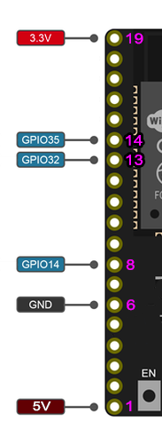
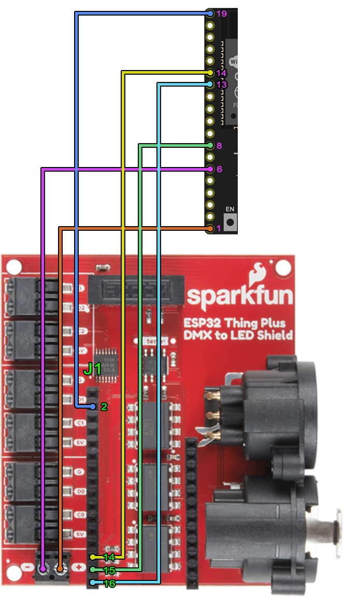

# Firmware for SID - DMX controlled

This repository holds a firmware for CircuitSetup's [Status Indicator Display](https://circuitsetup.us/product/delorean-time-machine-status-indicator-display-sid/) (SID) kit which allows control through DMX. It is designed to work using the [Sparkfun LED-to-DMX](https://www.sparkfun.com/products/15110) shield. (DMX control is also available for [Time Circuits Display](https://github.com/realA10001986/Time-Circuits-Display-DMX) and [Flux Capacitor](https://github.com/realA10001986/Flux-Capacitor-DMX))

CircuitSetup's SID with this firmware was used in this musical:

|  |
|:--:|
| Click to watch the video |

### DMX channels

<table>
    <tr><td>DMX channel</td><td>Function</td></tr>
    <tr><td>34</td><td>Brightness (0=off; 1-255=darkest-brightest)</td></tr>
    <tr><td>35</td><td>Auto-animate (1-255=lowest-highest=tt; 0=off, use ch36-45)</td></tr>
    <tr><td>36</td><td>Column 1 height</td></tr>
    <tr><td>37</td><td>Column 2 height</td></tr>
    <tr><td>38</td><td>Column 3 height</td></tr>
    <tr><td>39</td><td>Column 4 height</td></tr>
    <tr><td>40</td><td>Column 5 height</td></tr>
    <tr><td>41</td><td>Column 6 height</td></tr>
    <tr><td>42</td><td>Column 7 height</td></tr>
    <tr><td>43</td><td>Column 8 height</td></tr>
    <tr><td>44</td><td>Column 9 height</td></tr>
    <tr><td>45</td><td>Column 10 height</td></tr>
</table>

#### Packet verification

The DMX protocol uses no checksums. Therefore, transmission errors cannot be detected. Typically, such errors manifest themselves in flicker or a corrupted display for short moments. Since the SID is no ordinary light fixture, this can be an issue.

In order to at least filter out grossly malformed/corrupt DMX data packets, the firmware supports a simple DMX packet verifier: For a DMX data packet to be considered valid, _channel 46 must be at value 100_. If a packet contains any other value for this channel, the packet is ignored. 

To enable this filter, DMX_USE_VERIFY must be #defined in sid_global.h. This feature is disabled by default, because it hinders a global "black out". If your DMX controller can exclude channels from "black out" (or this function is not to be used), and you experience flicker, you can try to activate this packet verifier.

### Firmware update

To update the firmware without Arduino IDE/PlatformIO, copy a pre-compiled binary (filename must be "sidfw.bin") to a FAT32 formatted SD card, insert this card into the SID, and power up. The SID will show an egg timer while it updates its firmware. Afterwards it will reboot.

### Build information

Requires [esp_dmx](https://github.com/someweisguy/esp_dmx) library v4.0.1 or later.

### Hardware: Pin mapping

The SID control board has a row of solder pads next to the ESP32 dev board. All below pins are accessible on this row of solder pads:

The pin numbers listed below in SID column refer to above picture:

<table>
    <tr>
     <td align="center">SID</td><td align="center">LED-to-DMX shield</td>
    </tr>
    <tr>
     <td align="center">GPIO35 (pin 14)</a></td>
     <td align="center">J1 P14</td>
    </tr>
    <tr>
     <td align="center">GPIO14 (pin 8)</td>
     <td align="center">J1 P15</td>
    </tr>
    <tr>
     <td align="center">GPIO32 (pin 13)</td>
     <td align="center">J1 P16</td>
    </tr>
    <tr>
     <td align="center">3V3 (pin 19)</td>
     <td align="center">J1 P2</td>
    </tr>
    <tr>
     <td align="center">5V (pin 1)</td>
     <td align="center">J12 +</td>
    </tr>
    <tr>
     <td align="center">GND (pin 6)</td>
     <td align="center">J12 -</td>
    </tr>
 </table>

For some mysterious reason, the SID sometimes experiences transmission errors which go away when an SD card is in the SID's card slot.
